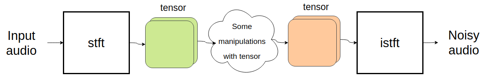
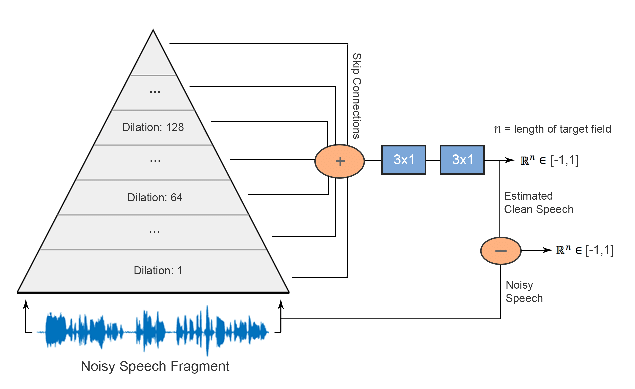
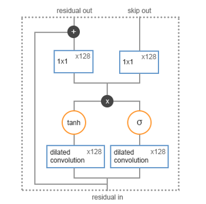
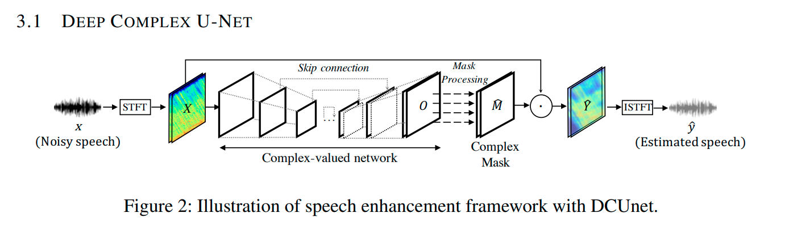

# Тестовое задание

Это небольшой отчет о ходе выполнения тестового задания. Нужно было реализовать простую сеть для audio denoising.

---
<details>
  <summary><strong>&#x1F53B;Условия задания</strong></summary>
    
# Тестовое задание
Требуется написать простую сеть для audio denoising для зафиксированной процедуры зашумления данных. 

### Рекомендуемые шаги для выполнения задания  

**Шаг 1.** Выбрать и скачать датасет речи.  

Список датасетов можно посмотреть [здесь](https://github.com/jim-schwoebel/voice_datasets). Рекомендуется использовать *VCTK dataset*, можно использовать не весь датасет, а только произвольную его часть с разделением на train, test и valid.  

**Шаг 2.** Написать и зафиксировать процедуру зашумления данных.  

Для зашумления данных предлагается использовать pipeline, изображенный на картинке ниже.     
Some manipulations включают в себя зануление элементов, домножение части элементов на число, прибавление числа и т.п. Данную процедуру необходимо зафиксировать для всех аудиозаписей и выбрать malipulations так, чтобы речь не затерлась. Необходимо предоставить примеры исходной и зашумленной аудиозаписи согласно зафиксированной процедуре.  

  

**Шаг 3.** Реализовать любую сеть для denoising audio.  

На данном шаге необходимо реализовать любую нейросеть для решения задачи audio denoising. Единственное требование к модели, чтобы она работала для waveform представления (на вход waveform, на выходе waveform).  

**Шаг 4.** Обучить модель.  

Обучить модель с любым подходящим лоссом (wSDR, SDR, MSE, L1 и т.п.) на данных, сгенерированных с помощью зафиксированный процедуры шага 2.  

**Шаг 5.** Оформить результаты.  

Реализовать и подсчитать метрики обученной модели на тестовой части датасета.  


### Что будет оцениваться?
1. Оформление кода на github.
2. Оформление результатов.
3. Структура репозитория.
4. Соответствие решения тестовому заданию.
5. Любые релевантные теме мысли, идеи и соображения.
</details>

---

#### Введение
Есть методы устранения шума в изображниях или в аудиосигналах с помощью отображения исходного изображения/аудио в другое пространство, в котором эти "данные" имеют разреженное представление. Например, если сделать 2D преобразования Фурье для изображения (преобразование Фурье для аудио), то окажется, что очень многие коэффициенты такого отображения очень близки к нулю, а, значит, и вклад в "значимую состовляющую данных" этих коэффициентов тоже невелик. Если занулить такие коэффициенты, а потом сделать обратное преобразование Фурье, то полученное изображение или аудио почти не потеряют в качестве, или могут даже в качестве бонуса избавиться от шумовых составляющих (в смысле шум детекторов/запиывающей аппаратуры).

В основе ряда методов denoising'а лежит сложное нелиенйное преобразование в другое пространство (латентное представление), а затем обратное преобразование переводит латентное представление в "исходные координаты", и получается исходный аудиосигнал с подавленными шумовыми составляющими.

#### Зашумление данных

Процедура зашумления данных состоит из двух последовательных изменений:
1. Находятся 10% наиболее длинных векторов STFT-представления (величин комплексных чисел) и среди них случайным образом выбираются 20% для зануления.
При этом, если изначально метрика для чистого сигнала (wSDR) равна -1, то после такого вида зашумления метрика ухудшается и становится равной ~-0.91
2. Находятся 90% наимение длинных векторов STFT-представления (величин комплексных чисел) и среди них случайным образом выбираются 50% и приравниваются 1.
При этом, если изначально метрика чистого сигнала равна -1, то после такого вида зашумления метрика ухудшается и становится равной ~-0.89.

[**clean**](audio/clean.wav)

[**noisy**](audio/ex_01_80.wav)

После двух таких зашумлений wSDR становится равной ~-0.81.
Сама процедура встроена в DataLoader, и при получении мини-батчей каждый раз накладываются несколько разные шумы в силу случайного выбора коэффициентов STFT.
Интересно, что после 1го зашумления дефекты в аудио почти незаметны. Чтобы такое зашумление стало более заметным, приходилось добиваться метрики порядка -0.6. [**пример**](audio/ex_0_50.wav)

Второй вид зашумления на слух хорошо заметен и при небольших отклонениях от -1 (~-0.95), и выражается в виде шипения. [**пример**](audio/ex_1_95.wav)

---
<details>
  <summary><strong>&#x1F53B;Ход выполнения задания</strong></summary>
    
#### 1. Простейший автоенкодер
* [notebook](trivial-autoencoder.ipynb)
    
Я решил начать с совсем простого автоенкодера, с одним сверточным слоем енкодера и одним сверточным слоем декодера, как в этом [примере](https://github.com/GuitarsAI/MLfAS/blob/master/MLAS_07_Denoising_Autoencoder.ipynb). Автор показывает на примере одной песни, что шумы хоть и остаются, но становится их заметно меньше.

```
Encoder = nn.Conv1d(in_channels=1, out_channels=32, kernel_size=2048, stride=32, padding=1023, bias=True)
Decoder = nn.ConvTranspose1d(in_channels=32, out_channels=1, kernel_size=2048, stride=32, padding=1023, bias=True)
```

- Из датасета я взял небольшую часть записей для проверки того, будет ли происходить хотя бы качественный overfitting, и будет ли модель хотя бы делать тождественное преобразование, восстанавливая исходный сигнал при подаче на вход исходного сигнала.
- Проверка показала, что модель не в состоянии делать тождественное преобразование. Видимо, у автора примера произошел overfitting на одной единственной песне.

Самая простая модель не удалась, поэтому я решил поискать более сложные существующие решения. Второе что я попробовал - это Denoising WaveNet.
#### 2. Denoising Wavenet
* [notebook](denoising-wavenet.ipynb)
* [arxiv.org "A Wavenet for Speech Denoising"](https://arxiv.org/abs/1706.07162)
* [github](https://github.com/saurav-pathak/WaveNet_PyTorch)

 


С нуля эту модель я не реализовывал, но пришлось ее немного поменять, убрал ненужные элементы, связанные с идентификацией говорящего. Подстроил под уже написанный код. Исходная конфигурация, описанная в github, получилась довольно тяжелой для моих мощностей (NVIDIA GeForce GTX 1080 Ti).

Чтобы обрабатывать записи мини-батчами, пришлось делать их одной длины, и короткие записи становятся длиной с максимальную запись в мини-батче. У модели нет фиксированного размера летентного представления (так как по сути всё строится на сверточных слоях, без Fully Connected слоев посередине), поэтому нет ограничения на длину входящих записей и они могут обрабатываться целиком. Но при вычислениях градиентов (даже мини-батч размера 2) на видеокарте не хватало памяти. Тогда я подсмотрел решение в [Wave-U-Net](https://github.com/f90/Wave-U-Net-Pytorch), где входящий мини-батч обрабатывается кусочками, которые последовательно подаются на вход сети.

- Так же как и с первой моделью, для начала решил проверить, насколько модель способна выучить тождественное преобразование на небольшом датасете. Судя по тому, что у сети есть skip-connections, у нее должно легко это получиться.
- Так и получилось. Но, к сожалению, сеть даже на небольшом датасете обучалась у меня довольно долго. При уменьшении числа Residual слоев и степени dilation модель обучалась несколько быстрее.
- А вот восстанавливать исходный сигнал из зашумленого у модели не получилось (тут нужно заметить, что на этот момент я только занулял коэффициенты STFT-представления, другие виды зашумления не делал). Из метрик здесь пробовал L1 и MSE.
- Так как модель обучалась медленно и не показала хорошего результата, я решил поискать что можно попробовать еще.
####  3. Deep Complex U-Net
* [notebook](dcu.ipynb)    
* [arxiv.org "PHASE-AWARE SPEECH ENHANCEMENT WITH DEEP COMPLEX U-NET"](https://openreview.net/pdf?id=SkeRTsAcYm)
* [github](https://github.com/pheepa/DCUnet)
 
    
Так же с нуля модель не реализовывал, переделал, чтобы на вход сеть принимала waveform, а не STFT-представление, убрал лишние преобразования, связанные с этим, больше экспериментировал с накладыванием шумов.
Из-за даунсэмплинга и апсэмплинга длины исходной записи и записи на выходе могут не совпадать, поэтому DataLoader определенным образом немного укорачивает исходную запись, чтобы результат получился с исходным размером.
- Сначала так же проверил, что модель способна делать тождественное преобразование.
- В качестве метрики используется wSDR - weightted source to distortion ratio - с помощью которой оценивал качество зашумленных версий сигналов по сравнению с чистыми и качество "очищенных" сетью.
- Опять же, в начале пробовал только обнуление коэффициентов STFT-представления. Судя по метрике, качество сигнала после обработки сетью улучшалось, но не сильно. На слух так вообще не заметно. Но, возможно, модель не очень хорошо справляется только с таким видом зашумлений - в речи появляются "артефакты".
- Затем я попробовал наоборот усиливать маленькие коэффициенты STFT-представления - поднимать их до 1. Если использовать только этот способ зашумления, то модель довольно хорошо справляется, судя и по wSDR, и по восприятию на слух. (wSDR улучшился с -0.86 до -0.99)
- В итоге, сеть обучал на комбинации зашумления 1го и 2го типа. Обучение происходило на 10% датасета (4.8k), валидация на 1% (0.48k). В последствии размер обучения увеличивать не стал, т.к. оверфиттинга не происходит, на валидации метрика показывает то же качество, что и на обучении.
- wSDR после зашумления на отложенной выборке (точечная оценка по 483 записям): -0.801
- wSDR после обработки на отложенной выборке: -0.926

[**noisy**](audio/ex_01_80.wav)
    
[**processed**](audio/out_01.wav)

    
</details>

---

#### Результаты
Построен пайплайн зашумления данных, включающий зануление и увеличение коэффициентов STFT-представления, пайплайн встроен в DataLoader, таким образом, от итерации к итерации зашумленные данные получаются немного разные.

Испытаны три модели для подавления шумов: простой сверточный автоэнкодер, Denoising Wavenet, DCUnet.

DCUnet на зашумленных данных (wSDR=-0.8) показал улучшение качества, достигнув wSDR=-0.926.

На зашумленных данных с занулением сеть улучшила качество с -0.89 до -0.92.

На зашумленных данных с увеличением коэффициентов сеть улучшила качество с -0.86 до -0.99.

[**noisy**](audio/ex_01_80.wav)
    
[**processed**](audio/out_01.wav)

---

<details>
  <summary><strong>&#x1F53B;Релевантные мысли</strong></summary>

Каждые отсчеты в waveform не независимые случайны величины, они некоторым образом зависят от предыдущих отсчётов. Так же и в STFT-представлении (абсолютные величины), если смотреть на него в развёртке по времени, если большой коэффициент присутствует в столбце, то с большей вероятностью будут присутствовать коэффициенты и в соседних столбцах. Аналогично, если в строке подряд идут не нулевые коэффициенты, то встретить в середине нулевой или сильно отличающийся коэффициент менее вероятно. 
    
Если это так, то может сработать некоторое оконное усреднение вдоль строк. Вдоль столбцов (т.е. по соседним частотами), думаю, тоже есть корреляция. Простой сверточный автоенкодер, вероятно, так и будет пытаться выучить такое "поведение". Но это сработает, скорее, только в случае рандомных зашумлений, которые я применял. У естественных шумов (например, шум в кафе или шум проезжающих машин) есть своя регулярная структура, и описанный способ вряд ли сработает.

(Дальше я пробую использовать сеть для подавления уличных шумов)
    
Интересно было бы попробовать использовать в задаче "Speech Enhancement" мел-кепстральные коэффициенты (MFCC), в какой-то статье читал про их использования в качестве дополнительных фич.
    
Так же интересно как сработает Constant-Q Transoform. Зная, что тембр человеческого голоса состоит из кратных гармоник, в CQT-представлении кратные гармоники будут отстоять друг от друга на определенное число строк, и, возможно, сверточный слой с определенным dilation сможет достать что-то полезное из этого. Но, если в случае STFT, его можно использовать в графе вычислений, градиенты через него проходят, и поэтому ошибку можно считать в time-domain сигналах (wSDR, например), то с CTQ-Transform так не получится, к тому же он медленнее работает. Тем не менее, можно использовать абсолютные значения CQT-представления для вычисления ошибки. А для восстановления аудио сигнала из абсолютных значений полученного CQT использовать алгоритм Гриффина-Лима (librosa).
    
</details>
    
---

#### Проверка работы сети при зашумлении уличными звуками
* [notebook](dcu_street.ipynb) 

Сделал еще один DataLoader, которому на вход подается лист файлов с шумами, которые будут использоваться для наложения шума на исходный файл с заданным коэффициентом. В качестве примера использовал звуки уличного траффика (с коэффициентом 0.5). Используя сохраненную модель, обученную на предыдущем этапе, получились следующие результаты:

- wSDR после зашумления на отложенной выборке: -0.4
- wSDR после обработки на отложенной выборке: -0.5

[**street**](audio/ex_street.wav)
    
[**processed**](audio/out_street.wav)

Но если теперь обучить эту сеть на новом датасете с уличными шумами, получаются такие результаты:

- wSDR после зашумления на отложенной выборке: -0.38
- wSDR после обработки на отложенной выборке: -0.94

[**street**](audio/ex_street2.wav)
    
[**processed**](audio/out_street2.wav)